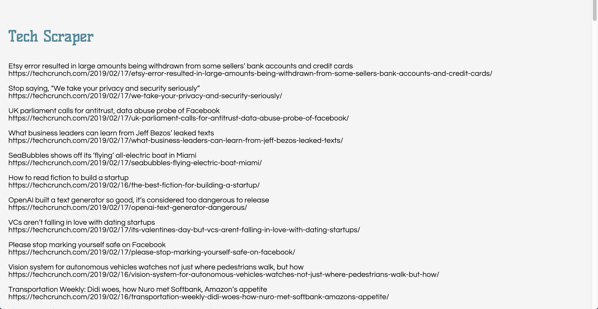
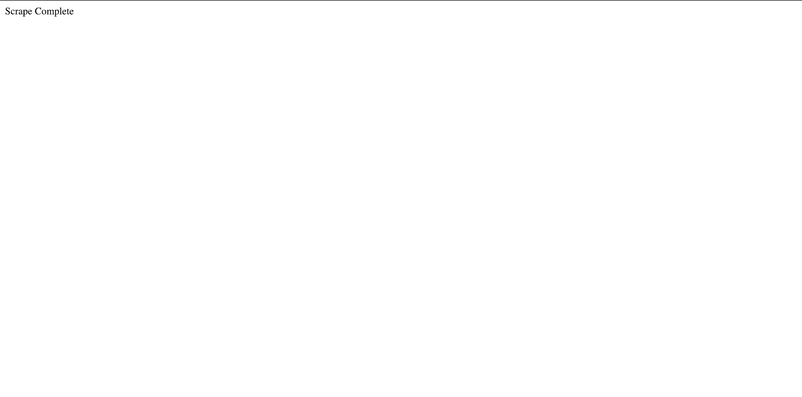
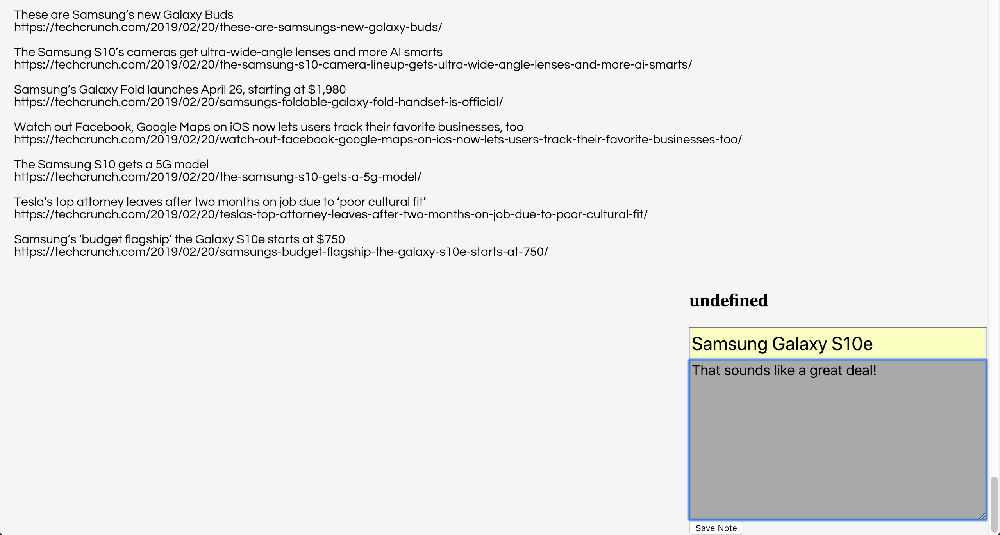

# nasa_scraper
A web app that lets the user view the latest articles from TechCrunch. These news articles are scraped from the TechCrunch website using Cheerio and Mongoose.
## Screenshots of the app functions

### The main `/articles` page is where the articles are found. 

### `/scrape` will add new articles to the page.

### After clicking on an article you can add a note to the article.
